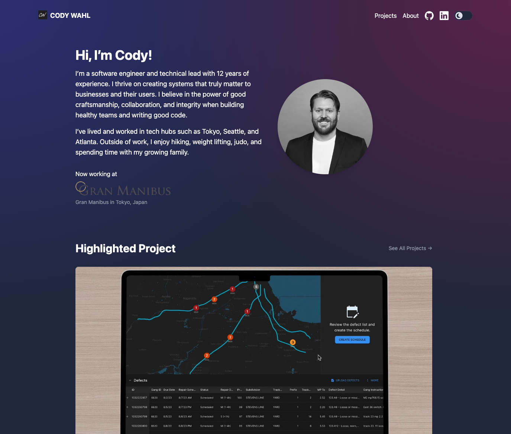

# My Portfolio

This is my personal portfolio website, showcasing my projects, experience, and skills. Built with **SvelteKit** and **Skeleton**, it leverages modern web technologies and deployment pipelines for a seamless experience.

---

## 🔧 Tech Stack

- **Framework**: Built with [SvelteKit](https://kit.svelte.dev/) for a performant and flexible front end.
- **Styling**: Designed with [Skeleton](https://www.skeleton.dev/), a minimalist UI toolkit for responsive and modern designs.
- **Hosting**: Deployed on [Vercel](https://vercel.com/), ensuring fast and reliable delivery with serverless infrastructure.
- **CI/CD**: Uses [GitHub Actions](https://github.com/features/actions) for automated testing and deployment.
- **TypeScript**: Developed with [TypeScript](https://www.typescriptlang.org/) to ensure type safety and maintainable code.
- **pnpm**: Managed with [pnpm](https://pnpm.io/), a fast, disk-efficient package manager designed for modern JavaScript workflows.

---
